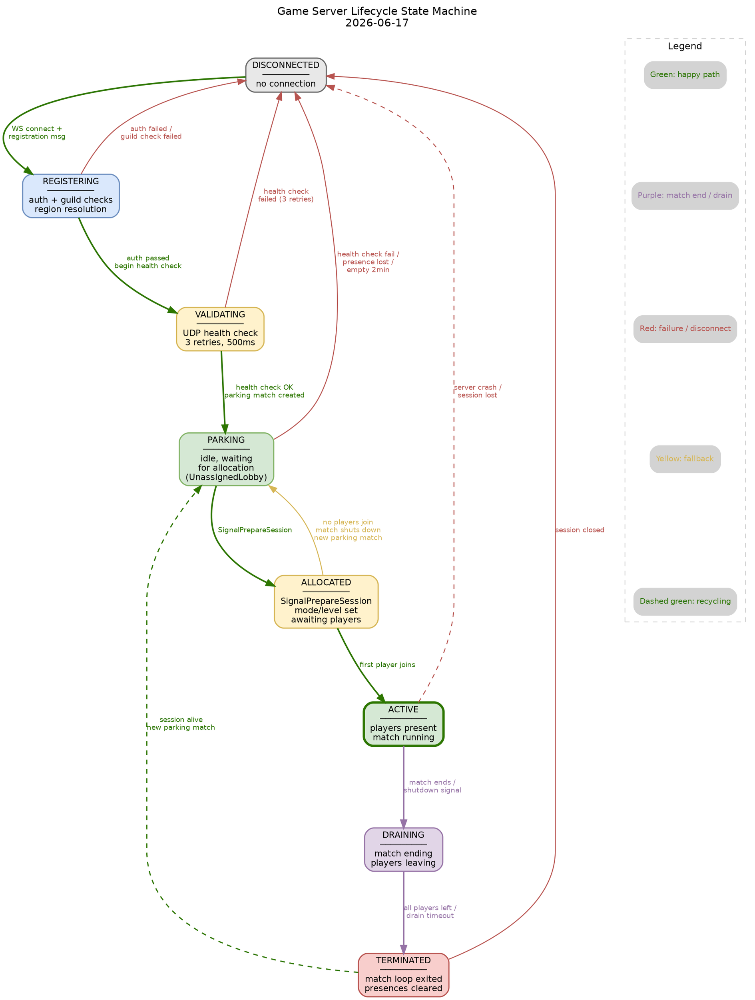

# State Machine Specification: Client Match Lifecycle & Game Server Lifecycle

**Date:** 2026-06-17
**Source data:** `nakama-rotated.log` (57,273 lifecycle events, ~24h window ending 2026-06-16T20:38Z)
**Code version:** current `main` branch

---

## 1. Client Match Lifecycle State Machine

### 1.1 States

| State                | Code Constant           | Description                                                                                                   |
| -------------------- | ----------------------- | ------------------------------------------------------------------------------------------------------------- |
| **Idle**             | `StateIdle`             | Player is not in any party, match, or matchmaking flow. Initial state on session creation.                    |
| **SocialConverging** | `StateSocialConverging` | Player is heading to the leader's social lobby after joining a party group. Has an active reservation.        |
| **SocialReady**      | `StateSocialReady`      | Player is in a social lobby, waiting for matchmaking to begin or for party actions. The "home base" state.    |
| **Holding**          | `StateHolding`          | Non-leader has sent `LobbyFindSessionRequest` and is waiting for the leader to submit the matchmaking ticket. |
| **Matchmaking**      | `StateMatchmaking`      | Player is on the leader's matchmaking ticket (or a solo ticket), waiting for a match to be found.             |
| **Joining**          | `StateJoining`          | A match was found and the player is connecting to the game server.                                            |
| **InMatch**          | `StateInMatch`          | Player is connected and playing in a match.                                                                   |
| **Returning**        | `StateReturning`        | Match ended and the player is heading back to a social lobby.                                                 |
| **Crashed**          | `StateCrashed`          | Client disconnected and a 27-second reconnect reservation is active (Quest timeout).                          |

### 1.2 Transition Inventory from Production Data

Data below combines legal (21,990 events) and illegal (35,283 events) transitions.
The high illegal count is expected -- the current `legalTransitions` map was intentionally conservative.

#### 1.2.1 Currently Legal Transitions (defined in `legalTransitions` map)

| From             | To               | Trigger                                                                 | Log Count                                                                     |
| ---------------- | ---------------- | ----------------------------------------------------------------------- | ----------------------------------------------------------------------------- |
| Idle             | SocialConverging | `JoinPartyGroup`                                                        | 0 (transition happens in party code; no separate log line in this log window) |
| SocialConverging | SocialReady      | joined social lobby                                                     | 0 (same -- party convergence is fast)                                         |
| SocialReady      | Holding          | `LobbyFindSessionRequest` (non-leader)                                  | 160                                                                           |
| SocialReady      | Matchmaking      | leader submits ticket / included on leader's ticket                     | 3,571                                                                         |
| SocialReady      | Idle             | reconnect failed, reservation expired (left party)                      | 22                                                                            |
| Holding          | Matchmaking      | included on leader's ticket / leader submitted ticket                   | 26                                                                            |
| Holding          | SocialReady      | matchmaking cancelled / join failed / leader in arena/combat / released | 973                                                                           |
| Matchmaking      | Joining          | match found, joining                                                    | 4,023                                                                         |
| Matchmaking      | SocialReady      | ticket cancelled / joined social lobby / join failed                    | 1,284                                                                         |
| Joining          | InMatch          | joined match / reconnected                                              | 2,901                                                                         |
| Joining          | SocialReady      | join failed / joined social lobby                                       | 3                                                                             |
| InMatch          | Returning        | match ended                                                             | 2,491                                                                         |
| InMatch          | Crashed          | disconnected                                                            | 1                                                                             |
| Returning        | SocialReady      | joined social lobby / join failed, regrouping                           | 6,535                                                                         |
| Crashed          | InMatch          | reconnected (27s)                                                       | 0 (logged via `StateInMatch` + "reconnected" in lobby_session.go)             |
| Crashed          | Idle             | reconnect failed, reservation expired                                   | 0                                                                             |

#### 1.2.2 Currently Illegal Transitions (flagged as warnings in logs)

Sorted by frequency. Each includes a recommendation.

| #   | From                           | To                                                                                | Reason | Count                                                                                                                                                                                                                                                                                                                                                                                                                                                                                                                                                                   | Recommendation |
| --- | ------------------------------ | --------------------------------------------------------------------------------- | ------ | ----------------------------------------------------------------------------------------------------------------------------------------------------------------------------------------------------------------------------------------------------------------------------------------------------------------------------------------------------------------------------------------------------------------------------------------------------------------------------------------------------------------------------------------------------------------------- | -------------- |
| 1   | **Joining -> Returning**       | match ended                                                                       | 6,603  | **(a) LEGALIZE.** Player connected to game server but the match ended before the InMatch transition fired (fast match end, or match ended during connection). This is the single highest-volume "illegal" transition and is completely benign. The Joining->InMatch->Returning sequence races with match-end signals.                                                                                                                                                                                                                                                   |
| 2   | **SocialReady -> Joining**     | match found, joining                                                              | 4,643  | **(a) LEGALIZE.** Player went from SocialReady directly to Joining, skipping the Matchmaking state. This happens when the matchmaker places a player directly (backfill) or when a solo player's social lobby find-or-create flow completes. The Holding/Matchmaking intermediate states were not entered because the player was placed directly.                                                                                                                                                                                                                       |
| 3   | **Returning -> Returning**     | match ended                                                                       | 4,250  | **(a) LEGALIZE (idempotent).** Multiple match-end signals arrive for the same player (e.g., match tick fires `MatchLeave` for all remaining players when match shuts down). The transition is harmless -- already in Returning. Make it a legal self-loop.                                                                                                                                                                                                                                                                                                              |
| 4   | **Returning -> Matchmaking**   | leader submitted ticket / included on leader's ticket                             | 3,848  | **(a) LEGALIZE.** Player is Returning but the party leader already submitted a new matchmaking ticket. The player hasn't reached SocialReady yet because `LobbyJoinEntrants` for the social lobby hasn't completed, but the leader's ticket already includes them. This is a race between the return-to-social flow and the leader's re-queue.                                                                                                                                                                                                                          |
| 5   | **Matchmaking -> Returning**   | match ended                                                                       | 3,474  | **(a) LEGALIZE.** Player was matchmaking, got placed into a match, and the match ended before the Joining/InMatch transitions fired. This is the same race as #1 but from an earlier state. Common when matches are very short or the player is placed into a match that's about to end.                                                                                                                                                                                                                                                                                |
| 6   | **Matchmaking -> Matchmaking** | leader submitted ticket / included on leader's ticket / ticket rebuild            | 3,145  | **(a) LEGALIZE (idempotent).** Ticket was rebuilt (late arrival, fallback timer, or leader re-submitted). Player stays in Matchmaking. Self-loop is valid.                                                                                                                                                                                                                                                                                                                                                                                                              |
| 7   | **SocialReady -> SocialReady** | joined social lobby / join failed, regrouping                                     | 2,001  | **(a) LEGALIZE (idempotent).** Player re-joins a social lobby while already in SocialReady (party convergence, lobby relocation, or join-fail retry). Harmless self-loop.                                                                                                                                                                                                                                                                                                                                                                                               |
| 8   | **Idle -> SocialReady**        | joined social lobby                                                               | 1,920  | **(a) LEGALIZE.** Solo player (no party) joins a social lobby directly from Idle. The designed path is Idle->SocialConverging->SocialReady, but solo players skip the party flow entirely. This must be a legal transition for non-party players.                                                                                                                                                                                                                                                                                                                       |
| 9   | **Idle -> Matchmaking**        | leader submitted ticket / included on leader's ticket                             | 937    | **(a) LEGALIZE.** Player just connected and the leader immediately submitted a ticket before the player reached SocialReady. The state machine initialized at Idle and the first lifecycle event was the ticket submission.                                                                                                                                                                                                                                                                                                                                             |
| 10  | **SocialReady -> InMatch**     | followed leader to match / reconnected / followed leader to social lobby via poll | 854    | **(a) LEGALIZE.** Party follow path places the player directly into the leader's match from SocialReady, or a reconnect joins a match from SocialReady (the reconnect path in `evr_lobby_session.go` transitions to InMatch). Both are valid paths.                                                                                                                                                                                                                                                                                                                     |
| 11  | **InMatch -> Matchmaking**     | leader submitted ticket / included on leader's ticket                             | 749    | **(c) INVESTIGATE, then (a) LEGALIZE.** Player is still InMatch but the leader has already submitted a new ticket. This means the leader left the match and re-queued while this player was still playing. The lifecycle object wasn't updated to Returning/SocialReady before the new ticket included them. High count suggests this is a real pattern, not a bug. **Likely cause:** match-end signal race -- the leader sees "match ended" before this player's MatchLeave fires. Should be legalized but the root cause (stale lifecycle state) should be addressed. |
| 12  | **Idle -> Holding**            | waiting for leader's ticket                                                       | 612    | **(a) LEGALIZE.** Similar to #9. Player connected, joined a party, but the lifecycle skipped SocialConverging/SocialReady because the party flow was fast. The first observed state change was directly to Holding.                                                                                                                                                                                                                                                                                                                                                     |
| 13  | **SocialReady -> Returning**   | match ended                                                                       | 598    | **(c) INVESTIGATE.** Player is in SocialReady but receives a "match ended" signal. This could mean: (1) the social lobby itself ended (post-match lobby 5-min timeout), or (2) a stale match-end signal from a previous match arrived late. The count is moderate. If (1), this is valid and should be legalized. If (2), the signal should be discarded.                                                                                                                                                                                                               |
| 14  | **Returning -> Joining**       | match found, joining                                                              | 405    | **(a) LEGALIZE.** Player is Returning but gets placed directly into a new match (backfill or fast re-queue). The Returning->SocialReady->Matchmaking->Joining sequence was compressed.                                                                                                                                                                                                                                                                                                                                                                                  |
| 15  | **Idle -> Joining**            | match found, joining                                                              | 388    | **(a) LEGALIZE.** Direct join from Idle (e.g., Echo Taxi `NextMatchID`, or direct match join command). Player was placed into a match without going through matchmaking.                                                                                                                                                                                                                                                                                                                                                                                                |
| 16  | **InMatch -> Joining**         | match found, joining                                                              | 139    | **(c) INVESTIGATE.** Player is InMatch but receives a "match found, joining" for a different match. This could indicate a legitimate transition (player's current match ended but the lifecycle wasn't updated before the new placement), or it could indicate a bug where a player is being yanked from one match to another. Count is moderate. **Recommendation:** Log the match IDs -- if it's the same match, it's a reconnect (legalize). If different matches, investigate whether the first match's leave was properly processed.                               |
| 17  | **Returning -> Holding**       | waiting for leader's ticket                                                       | 134    | **(a) LEGALIZE.** Player is Returning and sends a `LobbyFindSessionRequest` (non-leader) before reaching SocialReady. The return-to-social flow was in progress when the find request arrived.                                                                                                                                                                                                                                                                                                                                                                          |
| 18  | **Matchmaking -> Holding**     | waiting for leader's ticket                                                       | 97     | **(b) PREVENT.** Player is already on a matchmaking ticket but transitions to Holding (waiting for leader's ticket). This means the non-leader sent a `LobbyFindSessionRequest` while already matchmaking. The Holding state is for non-leaders who sent a find request _before_ the leader submitted. Going backwards from Matchmaking to Holding indicates either a ticket cancellation that wasn't reflected in the lifecycle, or a redundant find request. Should be blocked -- the player should stay in Matchmaking until the ticket resolves.                    |
| 19  | **Joining -> Joining**         | match found, joining                                                              | 57     | **(a) LEGALIZE (idempotent).** Duplicate join signal or reconnect during join. Self-loop.                                                                                                                                                                                                                                                                                                                                                                                                                                                                               |
| 20  | **Returning -> Crashed**       | disconnected                                                                      | 56     | **(a) LEGALIZE.** Player disconnected while returning to the social lobby. The crash reservation is still appropriate so they can reconnect.                                                                                                                                                                                                                                                                                                                                                                                                                            |
| 21  | **Crashed -> Matchmaking**     | leader submitted ticket / included on leader's ticket                             | 56     | **(a) LEGALIZE.** Player crashed but the leader submitted a new ticket. The crashed player's lifecycle was not reset before the ticket included them. This is a valid path if the crash reservation expired and the player reconnected as Idle, then got picked up by the leader's ticket.                                                                                                                                                                                                                                                                              |
| 22  | **Joining -> Crashed**         | disconnected                                                                      | 55     | **(a) LEGALIZE.** Player disconnected during the join phase. Crash reservation should activate.                                                                                                                                                                                                                                                                                                                                                                                                                                                                         |
| 23  | **Holding -> Holding**         | ticket cancelled for late arrival, rebuilding / waiting for leader's ticket       | 43     | **(a) LEGALIZE (idempotent).** Ticket rebuild while still in Holding. Self-loop.                                                                                                                                                                                                                                                                                                                                                                                                                                                                                        |
| 24  | **Crashed -> Returning**       | match ended                                                                       | 40     | **(a) LEGALIZE.** Player was crashed, the match ended (reconnect reservation consumed or match terminated), and they're now returning.                                                                                                                                                                                                                                                                                                                                                                                                                                  |
| 25  | **InMatch -> SocialReady**     | joined social lobby / join failed, regrouping                                     | 34     | **(c) INVESTIGATE.** Player jumps from InMatch directly to SocialReady. This could mean: (1) the social lobby join message was processed before the MatchLeave, or (2) a match ended and the player was placed in a social lobby without going through Returning. If (1), it's a race condition. If (2), it might be the post-match social lobby fast path. Low count warrants investigation before legalizing.                                                                                                                                                         |
| 26  | **InMatch -> Holding**         | waiting for leader's ticket                                                       | 27     | **(c) INVESTIGATE.** Player is InMatch but sends a `LobbyFindSessionRequest`. This should not happen if the client properly waits for the match to end. Could indicate a client-side bug where the lobby find request is sent prematurely.                                                                                                                                                                                                                                                                                                                              |
| 27  | **Joining -> Matchmaking**     | included on leader's ticket / leader submitted ticket                             | 22     | **(b) PREVENT.** Player is Joining (connecting to game server) but gets pulled onto a new matchmaking ticket. This is a genuine conflict -- the player should complete the join or fail, not be redirected to matchmaking.                                                                                                                                                                                                                                                                                                                                              |
| 28  | **Holding -> Returning**       | match ended                                                                       | 20     | **(a) LEGALIZE.** Player was Holding (waiting for leader's ticket) but a match ended signal arrived from their previous match. The match-end cleanup fires against their lifecycle.                                                                                                                                                                                                                                                                                                                                                                                     |
| 29  | **Matchmaking -> Crashed**     | disconnected                                                                      | 18     | **(a) LEGALIZE.** Player crashed while matchmaking. Valid failure path.                                                                                                                                                                                                                                                                                                                                                                                                                                                                                                 |
| 30  | **Idle -> Idle**               | reconnect failed, reservation expired                                             | 13     | **(a) LEGALIZE (idempotent).** Already idle, reconnect expiry fires again. Self-loop.                                                                                                                                                                                                                                                                                                                                                                                                                                                                                   |
| 31  | **Holding -> Joining**         | match found, joining                                                              | 12     | **(a) LEGALIZE.** Player was Holding but the match was found and they were placed directly (backfill path that skips the Matchmaking state).                                                                                                                                                                                                                                                                                                                                                                                                                            |
| 32  | **Crashed -> SocialReady**     | joined social lobby                                                               | 12     | **(a) LEGALIZE.** Player reconnected and was placed directly into a social lobby.                                                                                                                                                                                                                                                                                                                                                                                                                                                                                       |
| 33  | **Crashed -> Joining**         | match found, joining                                                              | 11     | **(a) LEGALIZE.** Player reconnected and was placed directly into a match.                                                                                                                                                                                                                                                                                                                                                                                                                                                                                              |
| 34  | **SocialReady -> Crashed**     | disconnected                                                                      | 3      | **(a) LEGALIZE.** Player crashed while in a social lobby.                                                                                                                                                                                                                                                                                                                                                                                                                                                                                                               |
| 35  | **Returning -> Idle**          | reconnect failed, reservation expired                                             | 2      | **(a) LEGALIZE.** Player was Returning, reconnect reservation expired. Unusual but valid.                                                                                                                                                                                                                                                                                                                                                                                                                                                                               |
| 36  | **Matchmaking -> InMatch**     | followed leader to match                                                          | 2      | **(a) LEGALIZE.** Player went from Matchmaking directly to InMatch (followed leader, skipping Joining). Low count, but the follow path does this.                                                                                                                                                                                                                                                                                                                                                                                                                       |
| 37  | **Idle -> Returning**          | match ended                                                                       | 2      | **(c) INVESTIGATE.** Player is Idle but receives a match-ended signal. Likely a stale signal from a previous session or lifecycle reset race. Should be discarded, not applied.                                                                                                                                                                                                                                                                                                                                                                                         |
| 38  | **Crashed -> Holding**         | waiting for leader's ticket                                                       | 1      | **(a) LEGALIZE.** Edge case: crashed player reconnected and immediately entered the holding pattern.                                                                                                                                                                                                                                                                                                                                                                                                                                                                    |

### 1.3 Recommended Legal Transition Set (v3)

Based on production data, the following is the recommended complete legal transition map. Transitions marked "self-loop" are idempotent and should be allowed but not logged at debug level.

```
Idle -> SocialConverging      # JoinPartyGroup
Idle -> SocialReady           # Solo player joins social lobby (no party)
Idle -> Holding               # Non-leader find request before reaching social
Idle -> Matchmaking           # Fast ticket inclusion from Idle
Idle -> Joining               # Direct join (Echo Taxi, /join command)
Idle -> Idle                  # Reconnect expiry re-fire (self-loop)

SocialConverging -> SocialReady   # Reached leader's social lobby

SocialReady -> Holding            # Non-leader find request
SocialReady -> Matchmaking        # Leader submits ticket / included on ticket
SocialReady -> Joining            # Direct placement (backfill)
SocialReady -> InMatch            # Party follow / reconnect
SocialReady -> Returning          # Social lobby ended (post-match timeout) [needs investigation]
SocialReady -> Crashed            # Disconnected in social
SocialReady -> SocialReady        # Re-join / re-convergence (self-loop)
SocialReady -> Idle               # Left party

Holding -> Matchmaking            # Included on leader's ticket
Holding -> Joining                # Direct placement (backfill, skip Matchmaking)
Holding -> SocialReady            # Matchmaking cancelled / leader in arena
Holding -> Returning              # Stale match-end signal
Holding -> Holding                # Ticket rebuild (self-loop)

Matchmaking -> Joining            # Match found
Matchmaking -> SocialReady        # Ticket cancelled / join failed
Matchmaking -> InMatch            # Followed leader (skip Joining)
Matchmaking -> Returning          # Match ended fast (race)
Matchmaking -> Matchmaking        # Ticket rebuild (self-loop)
Matchmaking -> Crashed            # Disconnected while matchmaking

Joining -> InMatch                # Connected to game server
Joining -> SocialReady            # Join failed, return to social
Joining -> Returning              # Match ended during join (race)
Joining -> Crashed                # Disconnected during join
Joining -> Joining                # Duplicate join signal (self-loop)

InMatch -> Returning              # Match ended naturally
InMatch -> Crashed                # Client disconnected
InMatch -> Matchmaking            # Leader re-queued (race) [needs investigation]
InMatch -> Joining                # Reconnect/placement race [needs investigation]

Returning -> SocialReady          # Back in social lobby
Returning -> Matchmaking          # Leader re-queued before social reached
Returning -> Joining              # Direct placement before social reached
Returning -> Holding              # Find request before social reached
Returning -> Crashed              # Disconnected while returning
Returning -> Returning            # Duplicate match-end signal (self-loop)
Returning -> Idle                 # Reconnect reservation expired

Crashed -> InMatch                # Reconnected within 27s
Crashed -> Idle                   # Reservation expired
Crashed -> SocialReady            # Reconnected to social
Crashed -> Matchmaking            # Leader submitted ticket
Crashed -> Joining                # Placed into match
Crashed -> Returning              # Match ended during crash
Crashed -> Holding                # Reconnected, waiting for leader
```

### 1.4 Transitions to PREVENT (enforce as errors)

| From                       | To                                                                                                                                     | Reason to Block |
| -------------------------- | -------------------------------------------------------------------------------------------------------------------------------------- | --------------- |
| **Matchmaking -> Holding** | Going backwards. If already on a ticket, staying on it is correct. A redundant find request from the non-leader should be discarded.   |
| **Joining -> Matchmaking** | Player is actively connecting. Being pulled onto a new ticket during connection is a conflict. The join should complete or fail first. |

### 1.5 Transitions to INVESTIGATE Before Deciding

| From                     | To  | Count                                                                            | Question |
| ------------------------ | --- | -------------------------------------------------------------------------------- | -------- |
| SocialReady -> Returning | 598 | Is this from social lobby timeout (5-min post-match), or stale match-end signal? |
| InMatch -> Joining       | 139 | Same match (reconnect) or different match (yanked)? Log both match IDs.          |
| InMatch -> SocialReady   | 34  | Race (social join before MatchLeave) or intentional fast path?                   |
| InMatch -> Holding       | 27  | Client sending find request while in match?                                      |
| Idle -> Returning        | 2   | Stale signal from prior session?                                                 |

### 1.6 DOT Graph: Client Match Lifecycle v3

```dot
digraph ClientMatchLifecycle {
    rankdir=TB;
    splines=true;
    nodesep=0.9;
    ranksep=1.2;
    fontname="Helvetica";
    label="Client Match Lifecycle State Machine — v3 (production-validated)\n2026-06-17";
    labelloc=t;
    fontsize=14;

    node [fontname="Helvetica" fontsize=11 style="filled,rounded" shape=box penwidth=1.5];
    edge [fontname="Helvetica" fontsize=9 penwidth=1.2];

    // States
    IDLE [
        label="IDLE\n─────────\nnot in any flow"
        fillcolor="#e8e8e8" color="#666666"
    ];
    SOCIAL_CONVERGING [
        label="SOCIAL_CONVERGING\n─────────\nheading to leader's\nsocial lobby"
        fillcolor="#dae8fc" color="#6c8ebf"
        style="filled,rounded,dashed"
    ];
    SOCIAL_READY [
        label="SOCIAL_READY\n─────────\nin social lobby\nwaiting for action"
        fillcolor="#d5e8d4" color="#82b366" penwidth=2.5
    ];
    HOLDING [
        label="HOLDING\n─────────\nsent find request\nwaiting for leader"
        fillcolor="#dae8fc" color="#6c8ebf"
    ];
    MATCHMAKING [
        label="MATCHMAKING\n─────────\non the ticket\nwaiting for match"
        fillcolor="#fff2cc" color="#d6b656"
    ];
    JOINING [
        label="JOINING\n─────────\nconnecting to\ngame server"
        fillcolor="#fff2cc" color="#d6b656"
    ];
    IN_MATCH [
        label="IN_MATCH\n─────────\nplaying"
        fillcolor="#d5e8d4" color="#2d7600" penwidth=3
    ];
    RETURNING [
        label="RETURNING\n─────────\nmatch ended\nheading to social"
        fillcolor="#e1d5e7" color="#9673a6"
    ];
    CRASHED [
        label="CRASHED\n─────────\ndisconnected\n27s reservation"
        fillcolor="#f8cecc" color="#b85450" penwidth=2
    ];

    // === HAPPY PATH (green) ===
    IDLE -> SOCIAL_CONVERGING [label="join party" color="#2d7600" fontcolor="#2d7600" penwidth=2];
    SOCIAL_CONVERGING -> SOCIAL_READY [label="reached lobby" color="#2d7600" fontcolor="#2d7600" penwidth=2];
    SOCIAL_READY -> HOLDING [label="find request\n(non-leader)" color="#2d7600" fontcolor="#2d7600" penwidth=2];
    SOCIAL_READY -> MATCHMAKING [label="leader submits ticket" color="#2d7600" fontcolor="#2d7600" penwidth=2];
    HOLDING -> MATCHMAKING [label="included on ticket" color="#2d7600" fontcolor="#2d7600" penwidth=2];
    MATCHMAKING -> JOINING [label="match found" color="#2d7600" fontcolor="#2d7600" penwidth=2];
    JOINING -> IN_MATCH [label="connected" color="#2d7600" fontcolor="#2d7600" penwidth=2];
    IN_MATCH -> RETURNING [label="match ended" color="#9673a6" fontcolor="#9673a6" penwidth=2];
    RETURNING -> SOCIAL_READY [label="back in social" color="#9673a6" fontcolor="#9673a6" penwidth=2];

    // === SOLO PATH (blue) ===
    IDLE -> SOCIAL_READY [label="solo join social\n(1920x)" color="#0066cc" fontcolor="#0066cc"];
    IDLE -> MATCHMAKING [label="fast ticket\n(937x)" color="#0066cc" fontcolor="#0066cc"];
    IDLE -> JOINING [label="direct join\n(388x)" color="#0066cc" fontcolor="#0066cc"];
    IDLE -> HOLDING [label="find w/o social\n(612x)" color="#0066cc" fontcolor="#0066cc"];

    // === FAST/SKIP PATHS (orange) ===
    SOCIAL_READY -> JOINING [label="direct placement\n(4643x)" color="#e67300" fontcolor="#e67300"];
    SOCIAL_READY -> IN_MATCH [label="follow leader\n(854x)" color="#e67300" fontcolor="#e67300"];
    RETURNING -> MATCHMAKING [label="quick re-queue\n(3848x)" color="#e67300" fontcolor="#e67300"];
    RETURNING -> JOINING [label="fast placement\n(405x)" color="#e67300" fontcolor="#e67300"];
    RETURNING -> HOLDING [label="find before social\n(134x)" color="#e67300" fontcolor="#e67300"];
    MATCHMAKING -> RETURNING [label="fast match end\n(3474x)" color="#e67300" fontcolor="#e67300"];
    JOINING -> RETURNING [label="match ended during join\n(6603x)" color="#e67300" fontcolor="#e67300"];
    HOLDING -> JOINING [label="direct placement\n(12x)" color="#e67300" fontcolor="#e67300"];
    MATCHMAKING -> IN_MATCH [label="follow leader\n(2x)" color="#e67300" fontcolor="#e67300"];

    // === CANCELLATION (yellow) ===
    MATCHMAKING -> SOCIAL_READY [label="ticket cancelled" color="#d6b656" fontcolor="#d6b656"];
    HOLDING -> SOCIAL_READY [label="cancelled" color="#d6b656" fontcolor="#d6b656"];
    JOINING -> SOCIAL_READY [label="join failed" color="#d6b656" fontcolor="#d6b656"];
    SOCIAL_READY -> IDLE [label="left party" color="#999999" fontcolor="#999999" style=dashed];

    // === SELF-LOOPS (grey) ===
    RETURNING -> RETURNING [label="re-return\n(4250x)" color="#999999" fontcolor="#999999"];
    MATCHMAKING -> MATCHMAKING [label="ticket rebuild\n(3145x)" color="#999999" fontcolor="#999999"];
    SOCIAL_READY -> SOCIAL_READY [label="re-join\n(2001x)" color="#999999" fontcolor="#999999"];
    JOINING -> JOINING [label="dup signal\n(57x)" color="#999999" fontcolor="#999999"];
    HOLDING -> HOLDING [label="rebuild\n(43x)" color="#999999" fontcolor="#999999"];
    IDLE -> IDLE [label="re-expiry\n(13x)" color="#999999" fontcolor="#999999"];

    // === CRASH PATHS (red) ===
    IN_MATCH -> CRASHED [label="disconnected" color="#b85450" fontcolor="#b85450"];
    JOINING -> CRASHED [label="disconnected\n(55x)" color="#b85450" fontcolor="#b85450"];
    RETURNING -> CRASHED [label="disconnected\n(56x)" color="#b85450" fontcolor="#b85450"];
    SOCIAL_READY -> CRASHED [label="disconnected\n(3x)" color="#b85450" fontcolor="#b85450"];
    MATCHMAKING -> CRASHED [label="disconnected\n(18x)" color="#b85450" fontcolor="#b85450"];
    CRASHED -> IN_MATCH [label="reconnected" color="#2d7600" fontcolor="#2d7600"];
    CRASHED -> IDLE [label="reservation expired" color="#b85450" fontcolor="#b85450" style=dashed];
    CRASHED -> SOCIAL_READY [label="reconnect to social\n(12x)" color="#e67300" fontcolor="#e67300"];
    CRASHED -> MATCHMAKING [label="ticket while crashed\n(56x)" color="#e67300" fontcolor="#e67300"];
    CRASHED -> JOINING [label="placed while crashed\n(11x)" color="#e67300" fontcolor="#e67300"];
    CRASHED -> RETURNING [label="match ended\n(40x)" color="#e67300" fontcolor="#e67300"];
    CRASHED -> HOLDING [label="holding\n(1x)" color="#e67300" fontcolor="#e67300"];

    // === INVESTIGATE (red dashed) ===
    IN_MATCH -> MATCHMAKING [label="leader re-queue\n(749x) ?" color="#cc0000" fontcolor="#cc0000" style=dashed];
    IN_MATCH -> JOINING [label="new match?\n(139x) ?" color="#cc0000" fontcolor="#cc0000" style=dashed];
    IN_MATCH -> SOCIAL_READY [label="race?\n(34x) ?" color="#cc0000" fontcolor="#cc0000" style=dashed];
    IN_MATCH -> HOLDING [label="premature find?\n(27x) ?" color="#cc0000" fontcolor="#cc0000" style=dashed];
    SOCIAL_READY -> RETURNING [label="social timeout?\n(598x) ?" color="#cc0000" fontcolor="#cc0000" style=dashed];

    // === BLOCKED (X'd) ===
    // Matchmaking -> Holding: PREVENT (backwards)
    // Joining -> Matchmaking: PREVENT (conflict)

    // Legend
    subgraph cluster_legend {
        label="Legend" fontsize=12 style="dashed" color="#cccccc"
        l1 [label="Green: designed happy path" shape=plaintext fontcolor="#2d7600" fontsize=10];
        l2 [label="Blue: solo player path" shape=plaintext fontcolor="#0066cc" fontsize=10];
        l3 [label="Orange: fast/skip path (production-validated)" shape=plaintext fontcolor="#e67300" fontsize=10];
        l4 [label="Yellow: cancellation/fallback" shape=plaintext fontcolor="#d6b656" fontsize=10];
        l5 [label="Red: crash/failure" shape=plaintext fontcolor="#b85450" fontsize=10];
        l6 [label="Red dashed: investigate before deciding" shape=plaintext fontcolor="#cc0000" fontsize=10];
        l7 [label="Grey: idempotent self-loops" shape=plaintext fontcolor="#999999" fontsize=10];
        l8 [label="Counts from ~24h log window (57K events)" shape=plaintext fontcolor="#666666" fontsize=9];
        l1 -> l2 -> l3 -> l4 -> l5 -> l6 -> l7 -> l8 [style=invis];
    }
}
```



---

## 2. Game Server Lifecycle State Machine

The game server lifecycle is NOT currently tracked by a state machine in code. The behavior is implicit in `evr_pipeline_gameserver.go` and `evr_match.go`. This section defines the states and transitions based on code analysis.

### 2.1 States

| State            | Description                                                                                                                                                                                                                   | Code Location                          |
| ---------------- | ----------------------------------------------------------------------------------------------------------------------------------------------------------------------------------------------------------------------------- | -------------------------------------- |
| **Disconnected** | No WebSocket connection. The server is not registered.                                                                                                                                                                        | Initial state / post-`session.Close()` |
| **Registering**  | WebSocket connected, `gameserverRegistrationRequest` is processing. Authentication, guild membership, region resolution in progress.                                                                                          | `evr_pipeline_gameserver.go:168`       |
| **Validating**   | Registration request received, health-check pings in progress (3 retries, 500ms timeout). Skipped if `novalidation` tag present.                                                                                              | `evr_pipeline_gameserver.go:332-363`   |
| **Parking**      | Registered and healthy. A "parking match" (`UnassignedLobby`) has been created. The server is idle, waiting to be allocated to a real match. The monitoring goroutine is running (5s health-check loop).                      | `evr_pipeline_gameserver.go:414-468`   |
| **Allocated**    | `SignalPrepareSession` received. The parking match transitions from `UnassignedLobby` to a configured lobby type (Public/Private). Mode, level, group, and features are set. The match is now discoverable by the matchmaker. | `evr_match.go:1655-1710`               |
| **Active**       | Players have joined. The match is running with active presences. The health-check goroutine continues. The match tick loop processes game state.                                                                              | `evr_match.go:1200+` (tick loop)       |
| **Draining**     | `MatchTerminate` or `MatchShutdown` initiated. A `terminateTick` deadline is set. Players are being removed. No new joins accepted.                                                                                           | `evr_match.go:1200-1214`               |
| **Terminated**   | Match loop returned nil. All presences removed. If the server session is still alive, a new parking match is created (return to Parking).                                                                                     | `evr_pipeline_gameserver.go:451-459`   |

### 2.2 Transitions

| From                        | To                                                                                          | Trigger                               | Code Location |
| --------------------------- | ------------------------------------------------------------------------------------------- | ------------------------------------- | ------------- |
| Disconnected -> Registering | WebSocket connect + `GameServerRegistration` message                                        | `evr_pipeline_gameserver.go:168`      |
| Registering -> Validating   | Auth + guild checks pass, sleep(2s), begin health check                                     | `evr_pipeline_gameserver.go:328-330`  |
| Registering -> Disconnected | Auth failure, guild check failure, version too old, invalid IP                              | `errFailedRegistration()`             |
| Validating -> Parking       | Health check passes (RTT >= 0), streams joined, parking match created                       | `evr_pipeline_gameserver.go:386-418`  |
| Validating -> Disconnected  | Health check fails after 3 retries                                                          | `errFailedRegistration()` at line 356 |
| Parking -> Allocated        | `SignalPrepareSession` received, lobby type set, mode/level configured                      | `evr_match.go:1655-1710`              |
| Parking -> Disconnected     | Server stops responding to health checks (monitoring goroutine)                             | `evr_pipeline_gameserver.go:431-439`  |
| Parking -> Disconnected     | Presence not found (game server stream cleared)                                             | `evr_pipeline_gameserver.go:444-446`  |
| Parking -> Disconnected     | Empty for 2 minutes (120 \* tickRate ticks)                                                 | `evr_match.go:1225-1233`              |
| Allocated -> Active         | First player joins (MatchJoinAttempt succeeds, presence tracked)                            | `evr_match.go:250+`                   |
| Allocated -> Parking        | Allocation abandoned (no players join, match shuts down, new parking match created)         | `evr_pipeline_gameserver.go:451-459`  |
| Active -> Draining          | Match ends naturally (`MatchTerminate`), or shutdown signal received, or empty for too long | `evr_match.go:1200-1220`              |
| Active -> Draining          | Post-match social lobby 5-min timeout                                                       | `evr_match.go:1237-1241`              |
| Draining -> Terminated      | All players left, or drain timeout expired                                                  | `evr_match.go:1204-1213`              |
| Terminated -> Parking       | Server session still alive, new parking match created by monitoring goroutine               | `evr_pipeline_gameserver.go:455-459`  |
| Terminated -> Disconnected  | Server session closed                                                                       | `evr_pipeline_gameserver.go:421`      |

### 2.3 Illegal Transition Handling

Since no game server state machine exists in code yet, there are no logged illegal transitions. The following should be enforced:

| Illegal Transition                       | Action    | Reason                                                                                                             |
| ---------------------------------------- | --------- | ------------------------------------------------------------------------------------------------------------------ |
| Registering -> Active                    | **Block** | Cannot skip validation and parking                                                                                 |
| Parking -> Active                        | **Block** | Must go through Allocated (SignalPrepareSession) first                                                             |
| Active -> Parking                        | **Block** | Must drain first; direct return to parking while players are present would orphan them                             |
| Draining -> Allocated                    | **Block** | Cannot re-allocate a draining match                                                                                |
| Disconnected -> Parking                  | **Block** | Must register first                                                                                                |
| Any -> Registering (except Disconnected) | **Block** | Re-registration requires disconnect first                                                                          |
| Allocated -> Allocated                   | **Warn**  | Double `SignalPrepareSession` on same match -- the match code already rejects this with "session already prepared" |

### 2.4 DOT Graph: Game Server Lifecycle



---

## 3. Implementation Recommendations

### 3.1 Where the State Machines Should Live

**Client Match Lifecycle** -- already exists in `evr_match_lifecycle.go`. The `legalTransitions` map needs to be updated with the v3 transition set defined in section 1.3. No new file needed.

**Game Server Lifecycle** -- should be a new file: `evr_gameserver_lifecycle.go`. Structure it identically to `evr_match_lifecycle.go`:

- Define `GameServerLifecycleState` as `uint8` with iota constants
- Define `legalGameServerTransitions` map
- Create `GameServerLifecycle` struct with `Transition()`, `State()`, `Reset()`, `History()` methods
- Store it on the `sessionWS` or on a new `GameServerSession` wrapper

### 3.2 How Transitions Should Be Enforced

**Phase 1 (current): Observer mode** -- already in place for client lifecycle. Apply the same pattern to game server lifecycle. All transitions are logged and applied. Illegal transitions are logged at `warn` level. This allows data collection without blocking players or servers.

**Phase 2: Selective enforcement** -- after the v3 transition set has been validated in production for at least one week:

1. **PREVENT transitions** (`Matchmaking->Holding`, `Joining->Matchmaking`): return an error from `Transition()` and do NOT apply the state change. Log at `error` level.
2. **Self-loops**: apply silently (no log, or `trace` level). They are idempotent and generate noise.
3. **Investigate transitions**: keep at `warn` level, add structured fields (both match IDs, party ID, etc.) to help diagnose.

**Phase 3: Full enforcement** -- after investigation is complete:

- All transitions not in the legal set return an error and are NOT applied
- Callers must handle the error (typically by logging and continuing, not by crashing the session)
- Metrics counter for rejected transitions: `lifecycle_transition_rejected{from, to, reason}`

### 3.3 Telemetry and Metrics

Add the following metrics (all as Nakama custom metrics via `nk.MetricsCounterAdd` / `nk.MetricsTimerRecord`):

| Metric                            | Type    | Tags                   | Purpose                                                               |
| --------------------------------- | ------- | ---------------------- | --------------------------------------------------------------------- |
| `lifecycle_transition`            | counter | `from`, `to`, `legal`  | Volume of each transition type                                        |
| `lifecycle_transition_rejected`   | counter | `from`, `to`, `reason` | Transitions blocked in enforcement mode                               |
| `lifecycle_state_duration`        | timer   | `state`                | How long players spend in each state                                  |
| `lifecycle_illegal_rate`          | gauge   | (none)                 | Ratio of illegal to total transitions (alert if > 20%)                |
| `gameserver_lifecycle_transition` | counter | `from`, `to`, `legal`  | Game server state transitions                                         |
| `gameserver_state_duration`       | timer   | `state`, `server_id`   | Time in each server state (Parking time is key for capacity planning) |

For state duration tracking, record `time.Now()` on each transition and emit the duration of the _previous_ state. The `LifecycleTransition` struct already has a `Timestamp` field that can be used.

### 3.4 Test Strategy

#### Unit Tests (in `evr_match_lifecycle_test.go`)

1. **Legal transition matrix test**: iterate every entry in the v3 `legalTransitions` map, call `Transition()`, assert no warning logged, assert state changed.
2. **Illegal transition test**: for each PREVENT pair (`Matchmaking->Holding`, `Joining->Matchmaking`), call `Transition()`, assert error returned, assert state did NOT change (Phase 2+).
3. **Self-loop idempotency**: for each self-loop (`Returning->Returning`, etc.), call `Transition()` twice, assert state unchanged, assert history has both entries.
4. **Reset test**: transition through several states, call `Reset()`, assert state is `Idle` and all fields cleared.
5. **History test**: perform a sequence of transitions, call `History()`, assert the returned slice matches expectations and is a copy (mutations don't affect the original).
6. **Concurrency test**: launch 100 goroutines each calling `Transition()`, assert no panics or data races.

#### Integration Tests

1. **Full lifecycle flow**: simulate a player connecting, joining party, matchmaking, joining match, match ending, returning to social. Assert each transition is legal and the final state is `SocialReady`.
2. **Solo player flow**: simulate a solo player (no party) joining a social lobby from `Idle`. Assert `Idle->SocialReady` is legal.
3. **Crash and reconnect flow**: simulate `InMatch->Crashed->InMatch`. Assert both transitions are legal.
4. **Race condition reproduction**: simulate the top 5 illegal transitions from production by triggering the same code paths. Assert they are now legal in v3.

#### Game Server Lifecycle Tests

1. **Registration flow**: `Disconnected->Registering->Validating->Parking`. Assert each transition is legal.
2. **Allocation and recycling**: `Parking->Allocated->Active->Draining->Terminated->Parking`. Assert full cycle.
3. **Failed registration**: `Registering->Disconnected`. Assert transition is legal and session is closed.
4. **Health check failure**: `Parking->Disconnected`. Assert transition is legal.
5. **Double allocation rejection**: `Allocated->Allocated`. Assert warning logged and transition rejected.

### 3.5 Migration Path

1. **Immediate** (no risk): Update `legalTransitions` in `evr_match_lifecycle.go` with the v3 set. This changes warnings to debug logs. Zero behavioral change -- observer mode still applies everything.
2. **Week 1**: Deploy v3 transitions. Monitor `lifecycle_transition` metrics. Verify illegal rate drops from ~62% to <5%.
3. **Week 2**: Add structured logging for the 5 "investigate" transitions. Review logs to make final legalize/prevent decisions.
4. **Week 3**: Implement PREVENT for `Matchmaking->Holding` and `Joining->Matchmaking`. Monitor for unexpected session failures.
5. **Week 4**: Implement game server lifecycle state machine. Deploy in observer mode.
6. **Week 5+**: Move both state machines to enforcement mode when confident.

### 3.6 Key Architectural Observations

**The 62% illegal rate is not a bug in player behavior.** It is a gap between the conservative initial design (which assumed a linear party-based flow) and the actual diversity of paths through the system. Solo players, backfill, reconnects, party follow, and match-end races all create valid paths that were not in the original design. The v3 transition set captures the reality.

**The game server lifecycle is simpler** because it has a single linear path with well-defined failure modes. The match state (`UnassignedLobby` vs. configured) already acts as an implicit state machine. The explicit state machine primarily adds observability and prevents double-allocation bugs.

**The biggest source of "illegal" transitions is match-end races.** When a match ends, the match loop fires `MatchLeave` for all remaining players. If the leader has already re-queued, the party members receive both "match ended" (-> Returning) and "included on leader's ticket" (-> Matchmaking) in rapid succession. The lifecycle sees `InMatch->Returning->Matchmaking` or sometimes `InMatch->Matchmaking` (if the ticket signal arrives first). Both are valid and should be legal.
